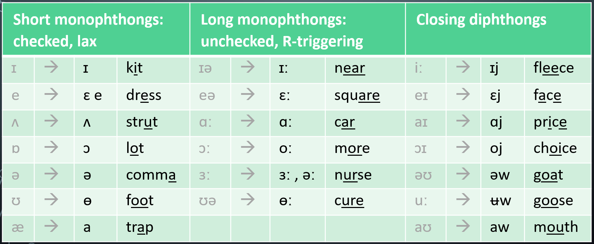

# Ending sounds

Contents:

* importance of ending sounds
* connected speech intro — link to "Liaison" page
* conflation table of examples

Conflation table here

(I already have a giant one in google sheets! — include a link to it here)

with win which whip witch wizz wist whisp&#x20;

wipe wife wine while wise&#x20;

cat is / catch it / cab is

cat catch cap can cab&#x20;

cage cape kale cane Kate cake came

gauge gape gale gain gate gay game gave gaze&#x20;

## Document resources


Below, you can see or access two large documents that I've been working on, primarily listing ending sounds of English words. The documents are unfinished, but contain plenty of useful information and word comparisons.


#### Terminology, Ending sounds, Minimal pairs etc



<figure><picture><source srcset="../.gitbook/assets/image_2025-03-15_095428055.png" media="(prefers-color-scheme: dark)"></picture><figcaption>
View <a href="https://docs.google.com/spreadsheets/d/1QvX6GpiJmwsHBz1RVgRvm_CLA4HnbCsSGaCrtJOwbzY/edit?gid=913030486#gid=913030486">Terminology, Ending sounds, Minimal pairs etc</a> on Google Sheets 
</figcaption></figure>

#### Minimal pairs sets



